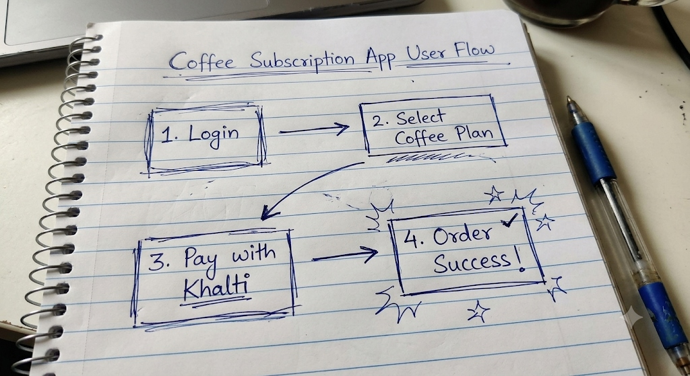

# Design Doc v1

**Team:** Group 5
**Project name:** Coffee Subscription Nepal
**Last updated:** 2026-09-10

## 1. Project purpose

What problem are you solving?
Providing a seamless way for people to get high-quality coffee delivered regularly without the hassle of manually ordering it every time.

## 2. Target users

Who is this for?

- Primary user: Regular coffee drinkers in Nepal.
- Secondary user, if any: Local delivery partners who handle the logistics.

## 3. Smallest useful version

What is the smallest version that would still be useful?
A simple web application where a user can select a subscription tier, enter payment/shipping details, and generate an order ticket for a local delivery partner.

### Rough user flow — 3–5 steps

Draw or describe the smallest user journey you can demonstrate. Put the user's action on each arrow and end with a visible result.

`Start → Select Coffee Plan → Complete Payment → Generate Delivery Order → Order Visible to Partner`

Evidence / sketch link: 

## 4. In scope

What are you building this semester?

- User registration and login.
- Coffee subscription tier selection.
- Mock payment integration.
- Dashboard for viewing active subscriptions and upcoming deliveries.

## 5. Out of scope

What are you **not** building this semester?

- Complex logistics routing (we will hand off to local delivery partners).
- An advanced inventory management system for roasters.
- International shipping support.

## 6. Midterm demo sentence

Our midterm demo will show:

> A user selecting a coffee subscription plan, completing a mock payment, and generating a successful delivery order ticket.

## 7. Final demo sentence

Our final demo will prove:

> [To be added later]

## 8. MVP features

| Feature | Required for MVP? | Owner | Issue link |
|---|---|---|---|
| User Auth | Yes | Rohit-coder201 | |
| Subscription Selection | Yes | Kushan2191 | |
| Payment Integration | Yes | notyouradhee | [#5](https://github.com/CapstoneDesign-Fall2026-UlsanCollege/team_2_capstone_design/issues/5) |

## 9. Risks and unknowns

| Risk / unknown | Why it matters | Plan |
|---|---|---|
| Payment Integration | Need a reliable gateway | Research local options (e.g., eSewa, Khalti) |
| Local Delivery Logistics | Unreliable tracking | Partner with existing local couriers |

## 10. Evidence links

- Planning Issue: [#6 Finalize week 2 report](https://github.com/CapstoneDesign-Fall2026-UlsanCollege/team_2_capstone_design/issues/6)
- Weekly Report: [Week 2 Weekly Report](weekly-report.md)
- Demo/proof links: [User Flow Sketch](user-flow-sketch.jpg)
