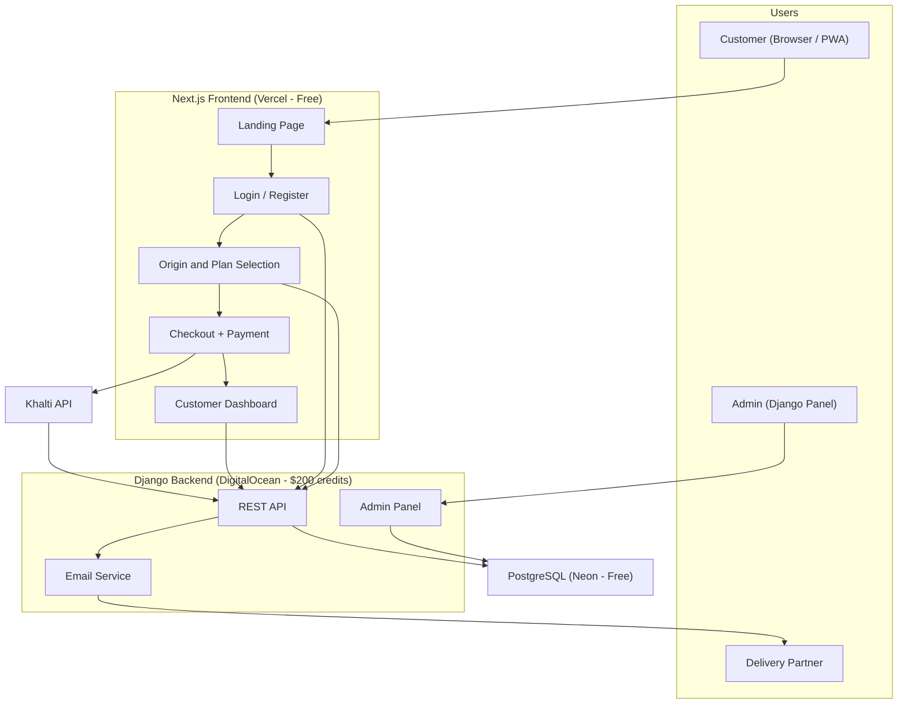

# Architecture Sketch

**Team:** Team 2  
**Project:** Coffee Subscription Nepal  
**Last updated:** 2026-09-19  

## One-sentence architecture

This project uses:

> Frontend: **Next.js (React PWA)** / Backend: **Django + Django REST Framework** / Data: **PostgreSQL (Neon)** / External services: **Khalti API (Payments)** + **Email notifications for delivery partners**

## How the product works

| Step | What happens |
|---|---|
| 1 | Customer visits landing page → learns about the service and our origins |
| 2 | Customer signs up (email + password or phone number) |
| 3 | Customer picks a **coffee origin** — Gulmi, Ilam, Bharatpur, or Kavrepalanchowk |
| 4 | Customer picks a **weight** — 150g / 250g / 500g |
| 5 | Customer picks a **plan** — pay-per-delivery (no commitment) or 3-month / 6-month / annual (discounted, upfront) |
| 6 | Customer picks a **delivery Monday** (one of ~4 Mondays in the month) |
| 7 | Customer pays via **Khalti** |
| 8 | Order is created → delivery partner receives **email notification** |
| 9 | Customer sees order on their **dashboard** |

## Pricing model

| Axis | How it works |
|---|---|
| **Origin** | 4 origins: Gulmi, Ilam, Bharatpur, Kavrepalanchowk. Each has its own base price per weight based on scarcity. Rarer lots cost more. |
| **Weight** | 150g (budget-friendly), 250g, 500g — price scales with weight |
| **Commitment** | Pay-per-delivery = full price, no commitment / 3-month = ~10% off (pay upfront) / 6-month or annual = ~15-20% off (pay upfront) |
| **Delivery** | Every Monday. Customer picks which Monday. If Monday is a holiday, delivery happens the day after. |

### Subscription rules

| Rule | Detail |
|---|---|
| **Pay-per-delivery** | No commitment. Customer pays before each delivery. Can stop anytime. |
| **3-month / 6-month / annual** | Customer pays all upfront. Origin is locked for the commitment period (discount applies). |
| **Pause / Skip** | Customers can pause or skip a delivery without canceling their subscription. |
| **Scarcity** | If an origin lot runs out mid-subscription: customer is informed in advance with a discount offer on alternatives, OR asked to wait with a 20g extra pack as compensation. |
| **Origin availability** | All 4 origins in stock at launch. Adjusted later based on demand and availability. |

## System diagram

## Main parts

| Part | What it does | Owner |
|---|---|---|
| Landing Page | Marketing page — who we are, our story, coffee origins, how it works | Frontend team |
| Auth (Register/Login) | Email + password AND phone number login | notyouradhee |
| Origin & Plan Selection | Browse 4 origins, pick weight, pick commitment, pick delivery Monday | Frontend + API |
| Checkout & Payment | Order summary, Khalti payment (per-delivery or upfront for commitments) | notyouradhee |
| Customer Dashboard | Active subscription, pause/skip, next delivery date, order history | Frontend team |
| Django Admin | Manage origins, lots, pricing, orders, customers, scarcity alerts | notyouradhee |
| Email Notifications | Send order details to delivery partner (automated, upgradeable later) | notyouradhee |
| Database | Users, origins, plans, subscriptions, orders, payments, pause records | notyouradhee |

## Important decisions

| Decision | Why | Risk |
|---|---|---|
| Django for backend | Admin panel manages origins, pricing, scarcity — all free | Learning curve |
| Next.js for frontend | SEO for landing page, PWA installable on phone | Team must learn React |
| PostgreSQL over MongoDB | Origins → Plans → Subscriptions → Orders → Payments is relational | Need internet (Neon is cloud) |
| Email for delivery partners | Simple and automated for now. Separate system planned for later. | May need upgrade |
| Both email + phone login | More accessible for Nepali customers | More auth work |
| Monday deliveries only | Simple logistics, predictable schedule. Holiday = next day delivery. | Less flexible |
| Upfront payment for commitments | Guarantees revenue, justifies discount. Pay-per-delivery for no-commitment users. | Higher friction for commitments |
| 150g option | Budget-friendly for Nepali consumers who can't always afford bigger packs | Lower margin per order |
| Pause/skip feature | Reduces cancellations — customers can take a break instead of quitting | Need to track pause state |

## What could break?

- Khalti test API may behave differently from production — test early
- Email delivery needs a reliable service (Gmail SMTP or SendGrid free tier)
- If a lot runs out, need a system to notify affected subscribers — manual via admin for now
- CORS issues when frontend (Vercel) calls backend (DigitalOcean) — need `django-cors-headers`
- Environment variables (API keys, DB URL) must never be committed to GitHub
- Tracking pause/skip state adds complexity to the subscription logic
