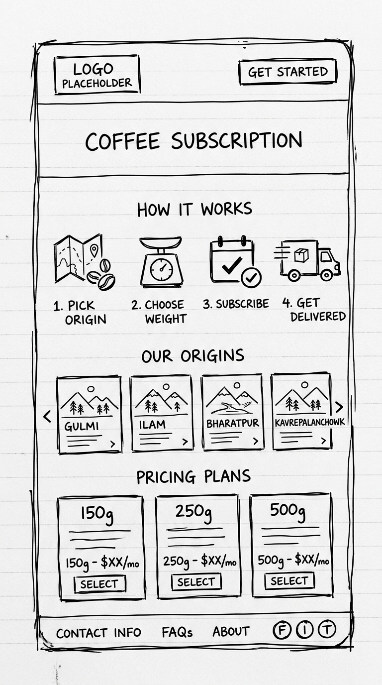
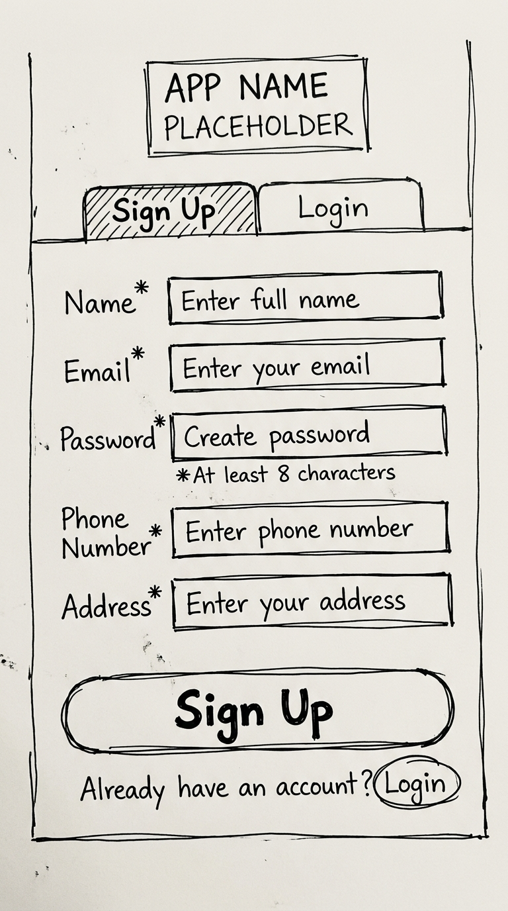
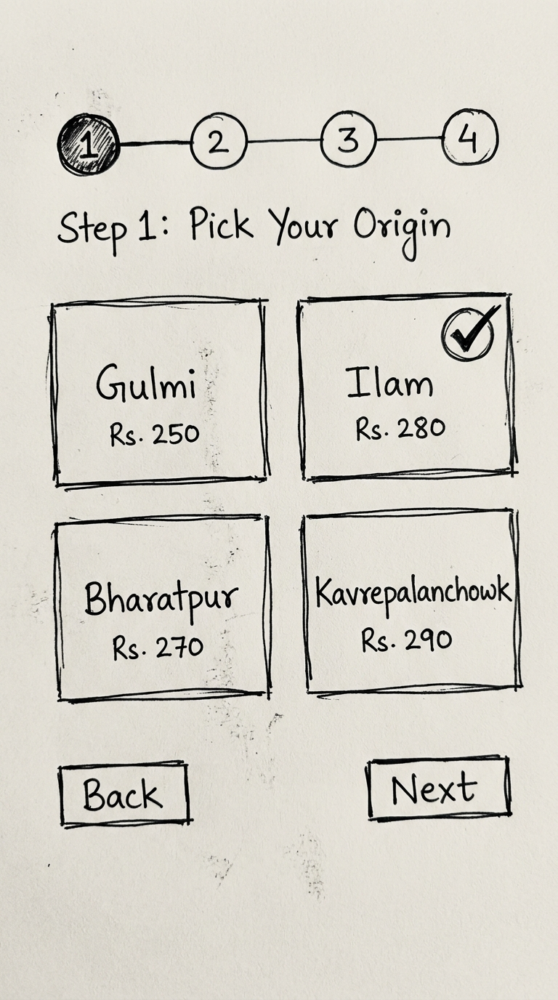
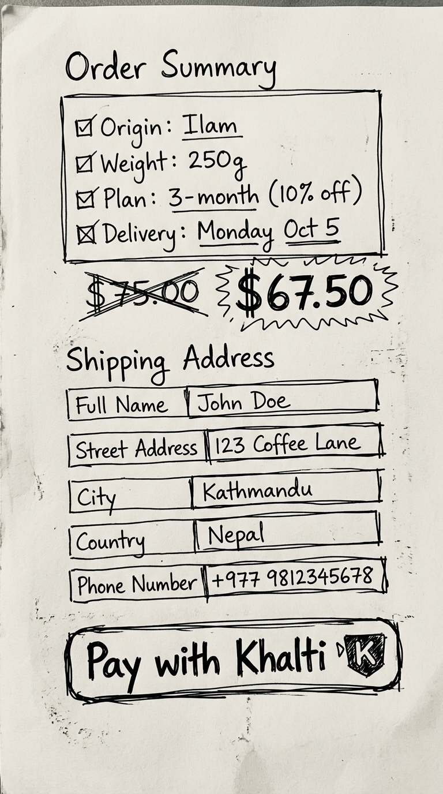
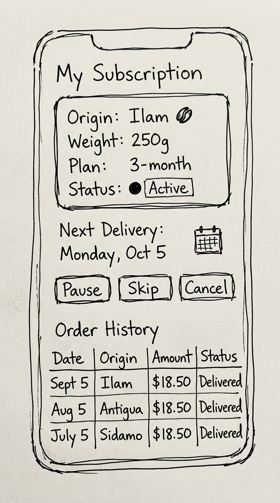

# Wireframe Notes

**Team:** Team 2  
**Week:** 3  

A wireframe can be a rough sketch, screenshot, photo, or simple diagram. It does not need to be beautiful.

## Screen 1 — Landing Page

- **Name:** Landing Page
- **Target user:** New visitors who don't know about our service yet
- **What the user does:** Scrolls through the page to learn about us, clicks "Get Started" to sign up
- **What the screen shows:**

| Section | Content |
|---|---|
| Hero Banner | Headline, short tagline about Nepali Himalayan coffee, "Get Started" button |
| How It Works | 3-4 simple steps: Pick Origin → Choose Weight → Subscribe → Get Delivered |
| Our Origins | 4 cards showing Gulmi, Ilam, Bharatpur, Kavrepalanchowk with short descriptions |
| Pricing | Weight options (150g / 250g / 500g) and commitment discounts (per-delivery, 3-month, 6-month, annual) |
| Footer | Contact info, social links |

- **Sketch/photo link:** 

## Screen 2 — Sign Up / Login

- **Name:** Authentication Page
- **Target user:** New and returning customers
- **What the user does:** Signs up with email + password or phone number. Returning users log in.
- **What the screen shows:**

| Element | Detail |
|---|---|
| Sign Up form | Name, email, password, phone number, address |
| Login form | Email or phone + password |
| Toggle | Switch between Sign Up and Login |

- **Sketch/photo link:** 

## Screen 3 — Origin & Plan Selection (Step-by-Step)

- **Name:** Subscription Builder
- **Target user:** Logged-in customer creating a new subscription
- **What the user does:** Goes through 4 steps one by one

| Step | What the user sees | What the user picks |
|---|---|---|
| Step 1 — Pick Origin | 4 origin cards with name, region info, and base price | Selects one origin (Gulmi, Ilam, Bharatpur, or Kavrepalanchowk) |
| Step 2 — Pick Weight | 3 weight options with price for selected origin | Selects 150g, 250g, or 500g |
| Step 3 — Pick Plan | 4 commitment options showing price and discount | Pay-per-delivery / 3-month (10% off) / 6-month (15% off) / Annual (20% off) |
| Step 4 — Pick Delivery Date | Calendar or list showing the 4 Mondays of the month | Selects one Monday |

- **Navigation:** "Back" and "Next" buttons on each step. Progress bar at the top.
- **Sketch/photo link:** 

## Screen 4 — Checkout & Payment

- **Name:** Checkout Page
- **Target user:** Customer who completed the 4-step selection
- **What the user does:** Reviews order summary, confirms shipping address, pays via Khalti
- **What the screen shows:**

| Element | Detail |
|---|---|
| Order summary | Origin, weight, plan type, delivery Monday, total price |
| Discount shown | If commitment plan, show original price crossed out + discounted price |
| Shipping address | Pre-filled from signup, editable |
| Pay button | "Pay with Khalti" — opens Khalti checkout widget |
| Confirmation | After payment: success message, order ID, next delivery date |

- **Sketch/photo link:** 

## Screen 5 — Customer Dashboard

- **Name:** My Subscription Dashboard
- **Target user:** Subscribed customer managing their subscription
- **What the user does:** Views subscription details, pauses/skips delivery, cancels subscription, views order history
- **What the screen shows:**

| Section | Content |
|---|---|
| Active Subscription | Origin name, weight, plan type, status (active / paused), start date |
| Next Delivery | Date (which Monday), countdown |
| Actions | "Pause Delivery" / "Skip Next Delivery" / "Cancel Subscription" buttons |
| Order History | Table: date, origin, weight, amount paid, status (delivered / upcoming) |

- **Sketch/photo link:** 

## Easiest first screen to build

We think the easiest first screen/interaction is:

> The **Landing Page** — it's a static marketing page with no API calls, no database queries, and no authentication logic. Just HTML/CSS content.

Because:

> It has zero backend dependencies. We can build and deploy it immediately while the backend and database are still being set up. It also gives us something to show the instructor early.
